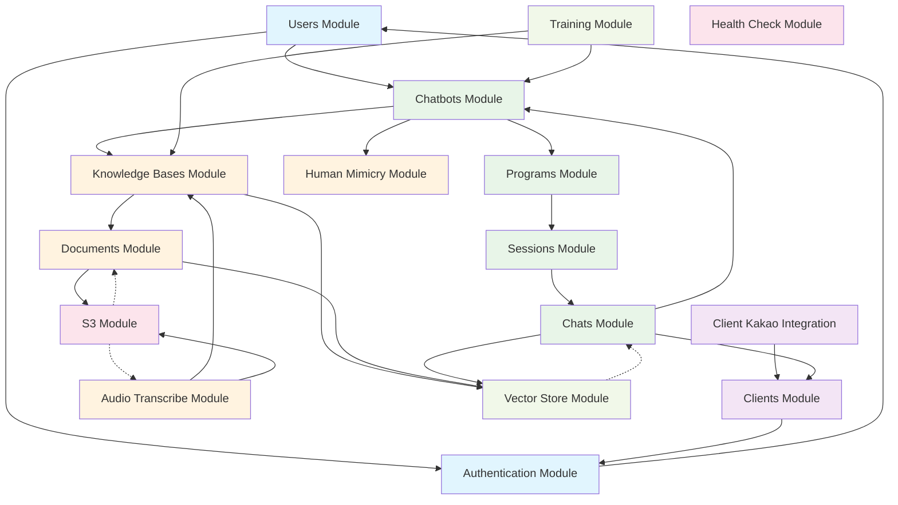

# Module Relationships

This diagram shows the relationships and dependencies between all modules in the Julia Coach AI Backend system.

## Module Categories

### 🔐 User Management

- **Users**: Core user management (coaches, admins)
- **Authentication**: Login, registration, OAuth, JWT management

### 👥 Client Management

- **Clients**: Client profile management
- **Client Kakao**: KakaoTalk integration for client onboarding

### 🤖 Core AI System

- **Chatbots**: AI chatbot configuration and management
- **Programs**: Coaching program definitions
- **Sessions**: Individual coaching session management
- **Chats**: Real-time chat interactions between clients and AI

### 📚 Knowledge Management

- **Knowledge Bases**: Document collections for AI training
- **Documents**: File upload and processing (PDF, DOCX, etc.)
- **Human Mimicry**: Coach communication style training data
- **Audio Transcribe**: Audio file transcription and processing

### 🔧 AI Infrastructure

- **Vector Store**: Semantic search and embeddings management
- **Training**: AI model training and fine-tuning

### 🛠️ Infrastructure

- **S3**: File storage and management
- **Health Check**: System health monitoring

## Key Relationships

1. **Coach → Chatbot → Program → Session → Chat**: Core workflow
2. **Knowledge Base → Documents → Vector Store**: Knowledge processing pipeline
3. **Audio Transcribe → Knowledge Base**: Audio content integration
4. **Human Mimicry → Chatbot**: Personality training
5. **Client → Chat**: End-user interaction point
